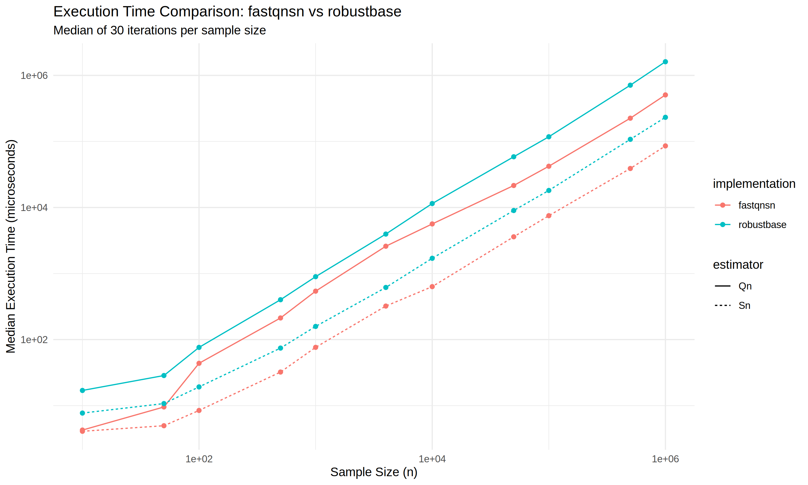

# fastqnsn

[](https://doi.org/10.5281/zenodo.18727053)

`fastqnsn` is a high-performance R package for computing the **Rousseeuw-Croux $Q_n$ and $S_n$** robust scale estimators. It is designed to provide peak performance across all sample sizes while maintaining absolute bit-identical correctness compared to `robustbase`.

## Key Features
- **Hybrid Architecture:**
  - **Serial Path:** High-speed deterministic C++ kernels with zero threading overhead for small and medium data ($n \le 10000$ for $S_n$, $n \le 3000$ for $Q_n$).
  - **Parallel Path:** Multi-threaded implementation using **RcppParallel (Intel TBB)** for large datasets.
- **Optimized Kernels:**
  - **$S_n$:** Efficient $O(n \log n)$ implementation using a two-pointer row-median algorithm.
  - **$Q_n$:** Multi-threaded Johnson-Mizoguchi (1978) selector for large datasets, with a brute-force $O(n^2)$ path for $n \le 256$.
- **Advanced Sorting Strategy:**
  - Uses **Boost Spreadsort** (hybrid radix sort) for small and medium datasets ($n < 7500$ for doubles, $n < 20000$ for integers).
  - Uses **TBB Parallel Sort** for large datasets.
- **Superior Accuracy:** 
  - Implements corrected $D_\infty = 2.21914446598508$ (fixing the legacy typo $2.2219$).
  - Uses modern finite-sample bias corrections from **Akinshin (2022)**.
- **Memory Optimized:** Allocation-free $S_n$ workers and efficient vector reuse in $Q_n$ refinement loops.
- **Robustness:** Built-in `std::isfinite` checks and 64-bit rank calculations for massive datasets.

## Installation
```R
# Requires Rcpp, RcppParallel, and a C++ compiler
# install.packages("remotes")
remotes::install_github("davdittrich/fastqnsn")
```

## Usage
```R
library(fastqnsn)
x <- rnorm(10000)

scale_sn <- sn(x)
scale_qn <- qn(x)
```

## Benchmarks

`fastqnsn` is significantly faster than `robustbase` across all sample sizes, especially for large datasets where multi-threading provides a major advantage.



### Summary of Results ($n=1,000,000$)
Median execution time (30 iterations):

| Estimator | `robustbase` | `fastqnsn` | Speedup |
| :--- | :--- | :--- | :--- |
| **$S_n$** | 231.9 ms | 85.6 ms | **2.7x** |
| **$Q_n$** | 1610.8 ms | 506.2 ms | **3.2x** |

### Medium Sample Performance ($n=4,000$)

| Estimator | `robustbase` | `fastqnsn` | Speedup |
| :--- | :--- | :--- | :--- |
| **$S_n$** | 0.62 ms | 0.32 ms | **1.9x** |
| **$Q_n$** | 3.96 ms | 2.59 ms | **1.5x** |

### Small Sample Performance ($n=10$)

| Estimator | `robustbase` | `fastqnsn` | Speedup |
| :--- | :--- | :--- | :--- |
| **$S_n$** | 7.7 µs | 4.1 µs | **1.9x** |
| **$Q_n$** | 17.0 µs | 4.3 µs | **4.0x** |

### Thread Scaling Evaluation

`fastqnsn` has been evaluated for optimal thread allocation across different sample sizes and estimators:

- **$Q_n$ Estimator:**
  - **Sorting:** Benefits significantly from `tbb::parallel_sort` for large $n$.
  - **JM Selection:** The Johnson-Mizoguchi counting and refinement steps are memory-bandwidth efficient and scale well for large datasets. Parallelization is enabled for $n > 3000$ to avoid threading overhead on smaller samples.
- **$S_n$ Estimator:**
  - **Row Medians:** The optimized two-pointer pass is extremely fast, making threading overhead more significant. Parallelization is enabled for $n > 10000$.
  - **Memory:** Uses stack allocation for $n \le 2000$ to minimize heap pressure.

*Note: `fastqnsn` uses updated consistency constants and finite-sample bias corrections from Akinshin (2022) by default.*

## Authors
**Dennis Alexis Valin Dittrich** (ORCID: 0000-0002-4438-8276)  

## References
- Rousseeuw, P. J., & Croux, C. (1993). Alternatives to the Median Absolute Deviation. *JASA*.
- Akinshin, A. (2022). Finite-sample Rousseeuw-Croux scale estimators. *arXiv:2209.12268*.
- Johnson, D. B., & Mizoguchi, T. (1978). Selecting the Kth element in X + Y. *SIAM J. Comput.*
