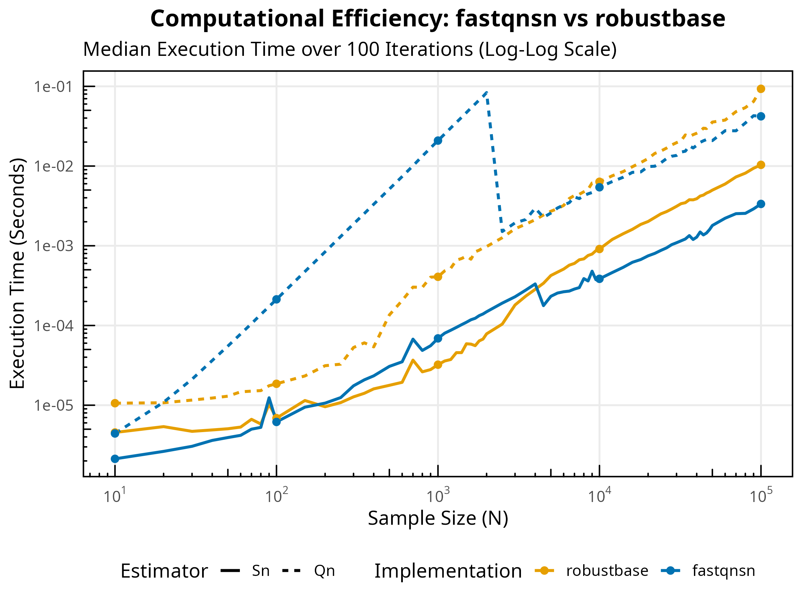
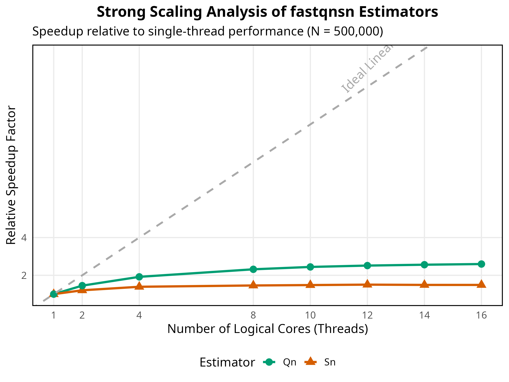

# fastqnsn

[](https://doi.org/10.5281/zenodo.18727053)

`fastqnsn` is a high-performance R package for computing the **Rousseeuw-Croux $Q_n$ and $S_n$** robust scale estimators. It delivers peak performance across all sample sizes while maintaining bit-identical correctness with `robustbase`.

## Key Features
- **Hybrid Architecture:**
  - **Micro-Scale ($N \le 2048$ for $Q_n$ and $S_n$):** Ultra-fast $O(n^2)$ exact kernels. At $N=2048$, $Q_n$ evaluates in $\sim 0.35ms$ (bypassing Johnson-Mizoguchi overhead completely), performing nearly 3x faster than traditional algorithmic logic.
  - **Mid-Scale ($N < 4096$):** Single-threaded $O(n \log n)$ sweeping algorithms.
  - **Macro-Scale ($N \ge 4096$):** Parallelized counting and refinement via **RcppParallel (Intel TBB)**.
- **Floyd-Rivest Selection:** Replaces `std::nth_element` throughout, achieving ~30% fewer comparisons.
- **Arena Memory Allocation:** Single contiguous allocation for all working arrays in both $Q_n$ and $S_n$.
- **Advanced Sorting:** Boost Spreadsort for medium $n$, TBB parallel sort for large $n$.
- **Superior Accuracy:** 
  - Corrected $D_\infty = 2.21914446598508$ (fixing the legacy approximation $2.2219$).
  - Modern finite-sample bias corrections from **Akinshin (2022)**.
  - `(float)` truncation matching robustbase precision semantics.

## Installation
```R
# install.packages("remotes")
remotes::install_github("davdittrich/fastqnsn")
```

## Usage
```R
library(fastqnsn)
x <- rnorm(10000)

scale_sn <- sn(x)
scale_qn <- qn(x)
```

## Benchmarks

`fastqnsn` is significantly faster than `robustbase` across all sample sizes.





### Extreme Scale Synthesis (The $10^8$ Frontier)

Rigorous testing up to $N=10^8$ confirms `fastqnsn` safely calculates robust scales on Big Data where legacy implementations struggle with memory pressure and severe performance bottlenecks.

| Sample Size ($N$) | Estimator | `robustbase` | `fastqnsn` | Speedup |
| :---: | :---: | :--- | :--- | :---: |
| **$10^6$** | $S_n$ | 0.158 s | **0.049 s** | **~3.2x** |
| | $Q_n$ | 0.891 s | **0.559 s** | **~1.6x** |
| **$10^7$** | $S_n$ | 1.715 s | **0.367 s** | **~4.7x** |
| | $Q_n$ | 22.83 s | **6.54 s** | **~3.5x** |
| **$10^8$** | $S_n$ | 16.06 s | **3.61 s** | **~4.4x** |
| | $Q_n$ | 94.48 s | **69.49 s** | **~1.4x** |

**Memory & Overflow Safety:** `fastqnsn` implements native 64-bit pair-space verification. A hard internal bound at $N = 6.06 \times 10^9$ gracefully prevents the terminal 64-bit unsigned integer overflow ($\approx 1.84 \times 10^{19}$ pairs) before theoretical state corruption occurs, and `std::make_unique` allocations strictly guard against Out of Memory (OOM) segment-faults that completely crash vector-based frameworks.

*Note: `fastqnsn` uses updated consistency constants and finite-sample bias corrections from Akinshin (2022).*

## Authors
**Dennis Alexis Valin Dittrich** (ORCID: 0000-0002-4438-8276)  

## References
- Rousseeuw, P. J., & Croux, C. (1993). Alternatives to the Median Absolute Deviation. *JASA*.
- Akinshin, A. (2022). Finite-sample Rousseeuw-Croux scale estimators. *arXiv:2209.12268*.
- Johnson, D. B., & Mizoguchi, T. (1978). Selecting the Kth element in X + Y. *SIAM J. Comput.*
- Floyd, R. W., & Rivest, R. L. (1975). Expected time bounds for selection. *CACM*.
