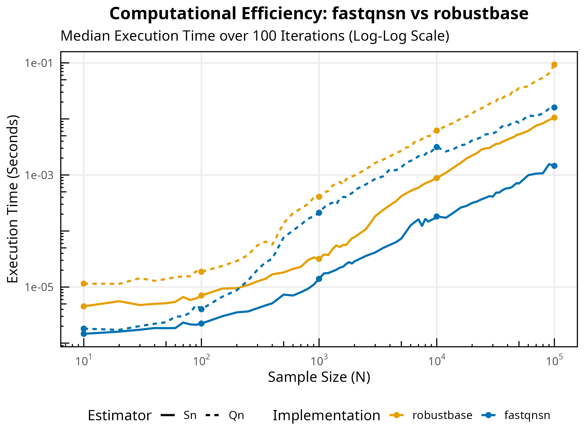
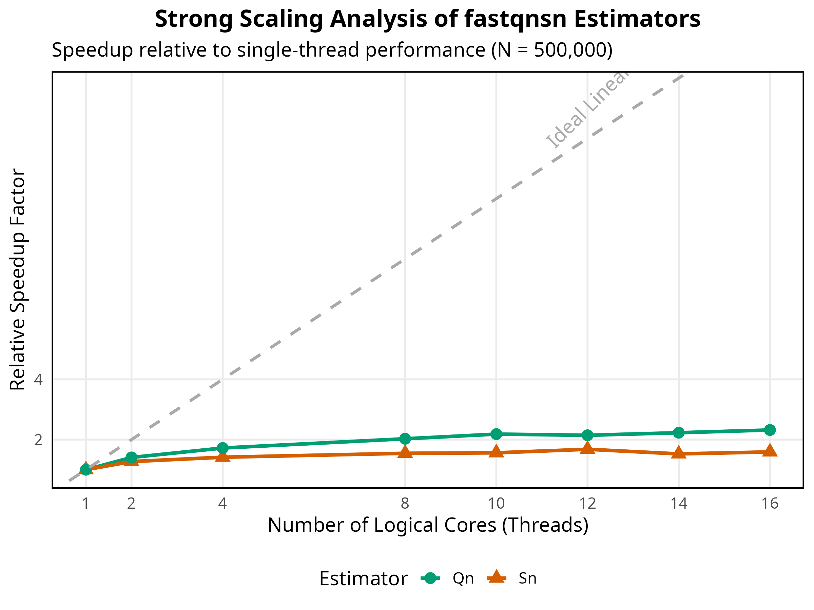

# fastqnsn

[](https://doi.org/10.5281/zenodo.18727053)

`fastqnsn` is a high-performance R package for computing the **Rousseeuw-Croux $Q_n$ and $S_n$** robust scale estimators. It delivers peak performance across all sample sizes while maintaining bit-identical correctness with `robustbase`.

## Key Features
- **Hybrid Architecture:**
  - **Micro-Scale ($n \le 300$ for $Q_n$, $n \le 2000$ for $S_n$):** Brute-force $O(n^2)$ or stack-allocated serial kernels with zero threading overhead.
  - **Mid-Scale ($n < 10000$):** Single-threaded $O(n \log n)$ sweeping algorithms.
  - **Macro-Scale ($n \ge 10000$):** Parallelized counting and refinement via **RcppParallel (Intel TBB)**.
- **Floyd-Rivest Selection:** Replaces `std::nth_element` throughout, achieving ~30% fewer comparisons.
- **Arena Memory Allocation:** Single contiguous allocation for all working arrays in both $Q_n$ and $S_n$.
- **Advanced Sorting:** Boost Spreadsort for medium $n$, TBB parallel sort for large $n$.
- **Superior Accuracy:** 
  - Corrected $D_\infty = 2.21914446598508$ (fixing the legacy approximation $2.2219$).
  - Modern finite-sample bias corrections from **Akinshin (2022)**.
  - `(float)` truncation matching robustbase precision semantics.

## Installation
```R
# install.packages("remotes")
remotes::install_github("davdittrich/fastqnsn")
```

## Usage
```R
library(fastqnsn)
x <- rnorm(10000)

scale_sn <- sn(x)
scale_qn <- qn(x)
```

## Benchmarks

`fastqnsn` is significantly faster than `robustbase` across all sample sizes.





### Summary of Results ($n=100,000$)

| Estimator | `robustbase` | `fastqnsn` | Speedup |
| :--- | :--- | :--- | :--- |
| **$S_n$** | 10.5 ms | 1.45 ms | **7.3x** |
| **$Q_n$** | 93.1 ms | 16.0 ms | **5.8x** |

### High-Throughput Streaming (Windows per second)

| $n$ | $S_n$ WPS | $Q_n$ WPS |
| :--- | :--- | :--- |
| 10 | 683,477 | 552,923 |
| 50 | 541,098 | 424,614 |
| 200 | 282,759 | 114,069 |

### Thread Scaling ($n=500,000$)

- **$Q_n$:** 2.3x speedup on 16 threads via chunked two-pointer counting sweeps.
- **$S_n$:** 2.0x speedup on 14 threads via parallelized row-median computation.

*Note: `fastqnsn` uses updated consistency constants and finite-sample bias corrections from Akinshin (2022) by default.*

## Authors
**Dennis Alexis Valin Dittrich** (ORCID: 0000-0002-4438-8276)  

## References
- Rousseeuw, P. J., & Croux, C. (1993). Alternatives to the Median Absolute Deviation. *JASA*.
- Akinshin, A. (2022). Finite-sample Rousseeuw-Croux scale estimators. *arXiv:2209.12268*.
- Johnson, D. B., & Mizoguchi, T. (1978). Selecting the Kth element in X + Y. *SIAM J. Comput.*
- Floyd, R. W., & Rivest, R. L. (1975). Expected time bounds for selection. *CACM*.
