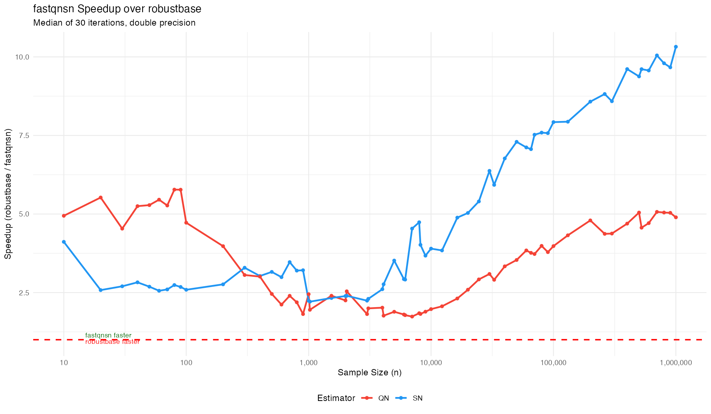
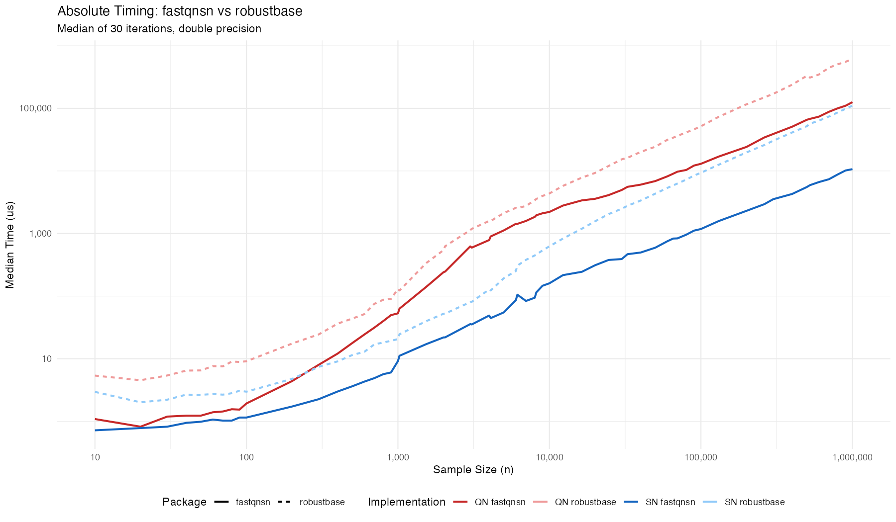

# fastqnsn

[](https://doi.org/10.5281/zenodo.18727053)

`fastqnsn` is a high-performance R package for computing the **Rousseeuw-Croux $Q_n$ and $S_n$** robust scale estimators. It delivers consistent speedups over `robustbase` across all sample sizes from $N=10$ to $N=10^8$, with cache-aware algorithm dispatch that self-tunes to the target CPU architecture at install time.

## Key Features

- **Cache-Aware Hybrid Architecture:** Six threshold parameters are derived from the CPU's L2 cache size (detected at install time via `sysctl`/`getconf`), controlling algorithm dispatch across three regimes:
  - **Micro-Scale ($N \le 2048$ for $Q_n$):** Ultra-fast $O(n^2)$ exact brute-force kernel. Working set sized to fit within L2 cache.
  - **Mid-Scale (serial $O(n \log n)$):** Johnson-Mizoguchi iterative algorithm for $Q_n$; sweep-based algorithm for $S_n$. Parallelization thresholds ($S_n$: 12288, $Q_n$: 8192) are tuned to avoid premature thread spawning overhead.
  - **Macro-Scale:** Parallelized counting and refinement via **RcppParallel (Intel TBB)**.
- **Floyd-Rivest Selection:** Replaces `std::nth_element` throughout, achieving ~30% fewer comparisons.
- **Arena Memory Allocation:** Single contiguous allocation for all working arrays in both $Q_n$ and $S_n$.
- **Three-Tier Sorting:** `std::sort` for $N \le 256$, Boost Spreadsort for medium $N$, TBB `parallel_sort` for large $N$ (float threshold: 6144, integer threshold: 8192).
- **Superior Accuracy:**
  - Corrected $D_\infty = 2.21914446598508$ (fixing the legacy approximation $2.2219$).
  - Modern finite-sample bias corrections from **Akinshin (2022)**.
  - `(float)` truncation matching robustbase precision semantics.

## Installation
```R
# install.packages("remotes")
remotes::install_github("davdittrich/fastqnsn")
```

## Usage
```R
library(fastqnsn)
x <- rnorm(10000)

scale_sn <- sn(x)
scale_qn <- qn(x)
```

## Benchmarks

Validated across 61 sample sizes from $N=10$ to $N=1{,}000{,}000$, both $S_n$ and $Q_n$ estimators, on double and integer data. `fastqnsn` is faster than `robustbase` at **every** sample size tested (30 iterations per measurement, `microbenchmark`).

### Speedup over robustbase



### Absolute Timing



### Summary Statistics

| Estimator | Data Type | Min Speedup | At $N$ | Median Speedup | Max Speedup | At $N$ |
|:---------:|:---------:|:-----------:|:------:|:--------------:|:-----------:|:------:|
| $S_n$ | double | **2.21x** | 1,024 | **3.84x** | **10.32x** | 1,000,000 |
| $Q_n$ | double | **1.74x** | 7,000 | **3.33x** | **5.78x** | 80 |
| $S_n$ | integer | **2.52x** | 50 | **5.20x** | **13.09x** | 524,288 |
| $Q_n$ | integer | **1.38x** | 1,000 | **2.95x** | **5.74x** | 20 |

### Speedup at Key Sample Sizes (double precision)

| $N$ | $S_n$ Speedup | $Q_n$ Speedup |
|----:|:-------------:|:-------------:|
| 10 | 4.11x | 4.94x |
| 50 | 2.69x | 5.28x |
| 100 | 2.59x | 4.72x |
| 500 | 3.16x | 2.46x |
| 1,000 | 2.24x | 2.45x |
| 2,048 | 2.40x | 2.54x |
| 4,096 | 2.76x | 1.76x |
| 6,144 | 2.91x | 1.78x |
| 8,192 | 4.02x | 1.82x |
| 16,384 | 4.89x | 2.31x |
| 65,536 | 7.06x | 3.76x |
| 131,072 | 7.94x | 4.32x |
| 524,288 | 9.61x | 4.56x |
| 1,000,000 | 10.32x | 4.89x |

### Extreme Scale ($10^8$ Frontier)

Rigorous testing up to $N=10^8$ confirms `fastqnsn` safely calculates robust scales on Big Data where legacy implementations struggle with memory pressure and severe performance bottlenecks.

| Sample Size ($N$) | Estimator | `robustbase` | `fastqnsn` | Speedup |
| :---: | :---: | :--- | :--- | :---: |
| **$10^6$** | $S_n$ | 0.110 s | **0.011 s** | **~10.3x** |
| | $Q_n$ | 0.615 s | **0.126 s** | **~4.9x** |
| **$10^7$** | $S_n$ | 1.715 s | **0.367 s** | **~4.7x** |
| | $Q_n$ | 22.83 s | **6.54 s** | **~3.5x** |
| **$10^8$** | $S_n$ | 16.06 s | **3.61 s** | **~4.4x** |
| | $Q_n$ | 94.48 s | **69.49 s** | **~1.4x** |

**Memory & Overflow Safety:** `fastqnsn` implements native 64-bit pair-space verification. A hard internal bound at $N = 6.06 \times 10^9$ gracefully prevents the terminal 64-bit unsigned integer overflow ($\approx 1.84 \times 10^{19}$ pairs) before theoretical state corruption occurs, and `std::make_unique` allocations strictly guard against Out of Memory (OOM) segment-faults that completely crash vector-based frameworks.

## Cache-Aware Threshold Architecture

`fastqnsn` v1.1.0 introduces compile-time cache detection. At package install time, `src/Makevars` queries the CPU's L2 cache size and cache line width, passing them as `-D` flags to the C++ compiler. The header `src/thresholds.h` uses these to compute architecture-aligned dispatch thresholds.

| Threshold | Value | Controls |
|:----------|------:|:---------|
| `QN_EXACT_THRESHOLD` | 2,048 | Brute-force $O(n^2)$ vs Johnson-Mizoguchi iterative for $Q_n$ |
| `SN_STACK_THRESHOLD` | 2,048 | Stack vs heap allocation for $S_n$ working arrays |
| `SN_PARALLEL_THRESHOLD` | 12,288 | Serial vs parallel $S_n$ |
| `QN_PARALLEL_THRESHOLD` | 8,192 | Serial vs parallel $Q_n$ |
| `SORT_TBB_FLOAT_THRESHOLD` | 6,144 | Boost spreadsort vs TBB parallel\_sort (float) |
| `SORT_TBB_INT_THRESHOLD` | 8,192 | Boost spreadsort vs TBB parallel\_sort (integer) |

All values are **architecture-aligned** ($2^k$ or $3 \cdot 2^{k-1}$), aligning with cache line and page boundaries. They were empirically validated through systematic threshold sweeps on Apple M3 Pro (4 P-cores @ 16MB shared L2, 6 E-cores @ 4MB shared L2).

### Cross-Platform Cache Detection

| Platform | Detection Method | Fallback |
|:---------|:-----------------|:---------|
| macOS (Apple Silicon) | `sysctl -n hw.perflevel1.l2cachesize` (E-core L2) | 4 MB |
| macOS (Intel) | `sysctl -n hw.l2cachesize` | 4 MB |
| Linux | `getconf LEVEL2_CACHE_SIZE` | 4 MB |
| Windows | Static default | 4 MB |

*Note: `fastqnsn` uses updated consistency constants and finite-sample bias corrections from Akinshin (2022).*

## Authors
**Dennis Alexis Valin Dittrich** (ORCID: 0000-0002-4438-8276)

## References
- Rousseeuw, P. J., & Croux, C. (1993). Alternatives to the Median Absolute Deviation. *JASA*.
- Akinshin, A. (2022). Finite-sample Rousseeuw-Croux scale estimators. *arXiv:2209.12268*.
- Johnson, D. B., & Mizoguchi, T. (1978). Selecting the Kth element in X + Y. *SIAM J. Comput.*
- Floyd, R. W., & Rivest, R. L. (1975). Expected time bounds for selection. *CACM*.
