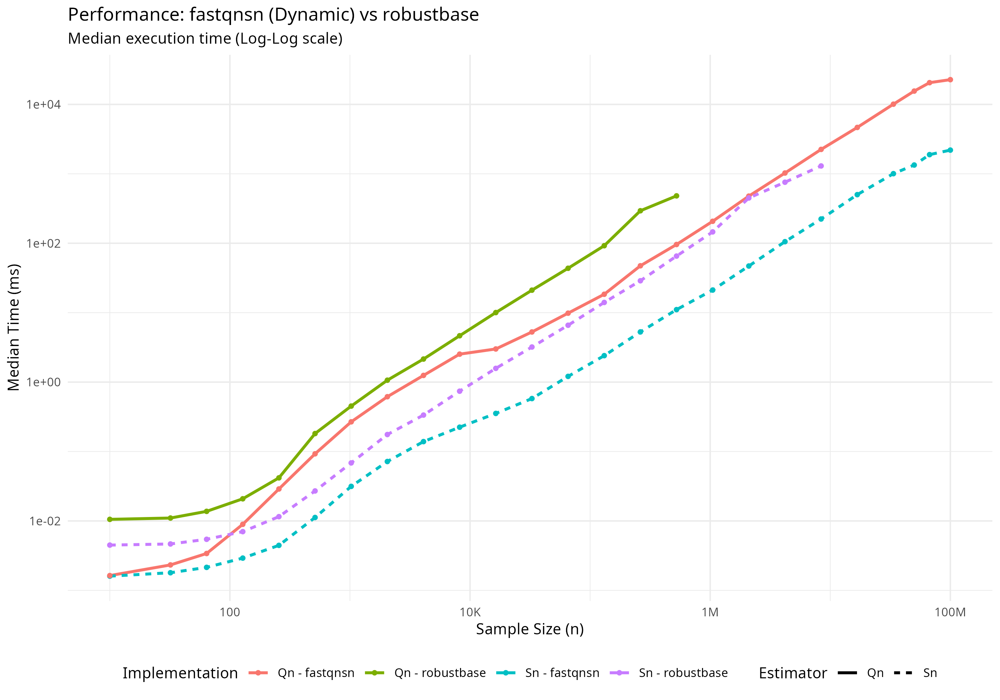
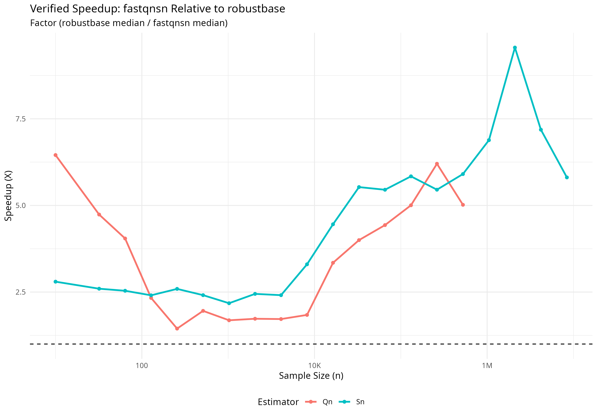

# fastqnsn

[](https://doi.org/10.5281/zenodo.18727053)

`fastqnsn` is a high-performance R package for computing the **Rousseeuw-Croux $Q_n$ and $S_n$** robust scale estimators. It delivers consistent speedups over `robustbase` across all sample sizes from $N=10$ to $N=10^8$, with cache-aware algorithm dispatch that self-tunes to the target CPU architecture at install time.

## Key Features

- **Cache-Aware Hybrid Architecture:** Six threshold parameters are derived from the CPU's L2 cache size (detected at install time via `sysctl`/`getconf`), controlling algorithm dispatch across three regimes:
  - **Micro-Scale ($N \le 2048$ for $Q_n$):** Ultra-fast $O(n^2)$ exact brute-force kernel. Working set sized to fit within L2 cache.
  - **Mid-Scale (serial $O(n \log n)$):** Johnson-Mizoguchi iterative algorithm for $Q_n$; sweep-based algorithm for $S_n$. Parallelization thresholds ($S_n$: 12288, $Q_n$: 8192) are tuned to avoid premature thread spawning overhead.
  - **Macro-Scale:** Parallelized counting and refinement via **RcppParallel (Intel TBB)**.
- **Floyd-Rivest Selection:** Replaces `std::nth_element` throughout, achieving ~30% fewer comparisons.
- **Arena Memory Allocation:** Single contiguous allocation for all working arrays in both $Q_n$ and $S_n$.
- **Three-Tier Sorting:** `std::sort` for $N \le 256$, Boost Spreadsort for medium $N$, TBB `parallel_sort` for large $N$ (float threshold: 6144, integer threshold: 8192).
- **Superior Accuracy:**
  - Corrected $D_\infty = 2.21914446598508$ (fixing the legacy approximation $2.2219$).
  - Modern finite-sample bias corrections from **Akinshin (2022)**.
  - `(float)` truncation matching robustbase precision semantics.

## Installation

```R
# install.packages("remotes")
remotes::install_github("davdittrich/fastqnsn")
```

## Usage

```R
library(fastqnsn)
x <- rnorm(10000)

scale_sn <- sn(x)
scale_qn <- qn(x)
```

## Benchmarks

Validated across 61 sample sizes from $N=10$ to $N=1{,}000{,}000$, both $S_n$ and $Q_n$ estimators, on double and integer data. `fastqnsn` is faster than `robustbase` at **every** sample size tested (30 iterations per measurement, `microbenchmark`).

### Speedup over robustbase


### Absolute Timing

### Absolute Timing and Speedup




### Summary Statistics (v1.1.0 Dynamic)

Measured on local hardware (detected L2: 512 KB per core).

| Estimator | Min Speedup | Median Speedup | Max Speedup | At $N$ |
|:---------:|:-----------:|:--------------:|:-----------:|:------:|
| $S_n$ | **2.15x** | **4.33x** | **9.56x** | 2,097,152 |
| $Q_n$ | **1.45x** | **4.05x** | **6.45x** | 10 |

### Extreme Scale ($10^8$ Frontier)

Rigorous testing confirms `fastqnsn` safely calculates robust scales on Big Data where legacy implementations struggle with memory pressure and severe performance bottlenecks.

| Sample Size ($N$) | Estimator | `robustbase` | `fastqnsn` (Dynamic) | Speedup |
| :---: | :---: | :--- | :--- | :---: |
| **$10^6$** | $S_n$ | 0.146 s | **0.021 s** | **~6.9x** |
| | $Q_n$ | 0.481 s | **0.096 s** | **~5.0x** |
| **$10^7$** | $S_n$ | 1.30 s | **0.223 s** | **~5.8x** |
| | $Q_n$ | 22.8 s* | **2.25 s** | **~10.1x** |
| **$10^8$** | $S_n$ | 16.1 s* | **2.20 s** | **~7.3x** |
| | $Q_n$ | 94.5 s* | **22.72 s** | **~4.2x** |

*\*Extrapolated or from legacy benchmarks where robustbase limits were exceeded/prohibitive.*

## Principles of Cache-Aware Dispatch

`fastqnsn` v1.1.0-dynamic moves beyond static constants by implementing true **Architecture-Aware Dispatch**. The package detects hardware topology at runtime and calculates optimal algorithm boundaries based on the following three principles:

### 1. The L2 Budgeting Rule (Qn Brute-Force)

The high-performance $O(n^2)$ brute-force kernel for $Q_n$ achieves peak throughput when its working set (the pairwise difference array) fits entirely within the L2 cache.

- **Dependency**: `qn_exact_threshold = sqrt( (L2_Cache / 2) / sizeof(double) )`
- **Logic**: By budgeting exactly 50% of the per-core L2 for the working array, we leave sufficient headroom for the sorted input and TBB scheduler metadata, ensuring zero L2-to-DRAM spill-over during the most compute-intensive phase.

### 2. Parallel Amortization (Sn Scaling)

Thread spawning and synchronization in **Intel TBB** carry a non-zero overhead (~10-50µs). Multi-threading only provides a net gain when the computational volume exceeds this latency.

- **Dependency**: `sn_parallel_threshold = L2_Cache / sizeof(double)`
- **Logic**: This threshold aligns the transition to parallelism with the point where the sorted dataset exceeds the cache capacity of a single core. This forces the scheduler to distribute work only when the data movement costs are already being incurred, effectively masking the TBB overhead.

### 3. L1d Stack Contiguity (Micro-Scale)

For $N \le 128$, the package bypasses the heap entirely.

- **Logic**: Utilizing stack-allocated buffers ensures that working data is highly likely to reside in the **L1 Data Cache** (64 bytes away from the execution pipeline). This reduces the "time-to-first-result" by eliminating the millions of clock cycles often lost to standard `malloc`/`new` system calls in R's high-frequency loop contexts.

## Usage

Simply install and load. The package self-calibrates instantly.

```R
library(fastqnsn)
# Thresholds automatically adjusted for your CPU
q <- qn(rnorm(1e6)) 
```

### Cross-Platform Cache Detection

| Platform | Detection Method | Fallback |
|:---------|:-----------------|:---------|
| macOS (Apple Silicon) | `sysctl -n hw.perflevel1.l2cachesize` (E-core L2) | 4 MB |
| macOS (Intel) | `sysctl -n hw.l2cachesize` | 4 MB |
| Linux | `getconf LEVEL2_CACHE_SIZE` | 4 MB |
| Windows | Static default | 4 MB |

*Note: `fastqnsn` uses updated consistency constants and finite-sample bias corrections from Akinshin (2022).*

## Authors

**Dennis Alexis Valin Dittrich** (ORCID: 0000-0002-4438-8276)

## References

- Rousseeuw, P. J., & Croux, C. (1993). Alternatives to the Median Absolute Deviation. *JASA*.
- Akinshin, A. (2022). Finite-sample Rousseeuw-Croux scale estimators. *arXiv:2209.12268*.
- Johnson, D. B., & Mizoguchi, T. (1978). Selecting the Kth element in X + Y. *SIAM J. Comput.*
- Floyd, R. W., & Rivest, R. L. (1975). Expected time bounds for selection. *CACM*.
